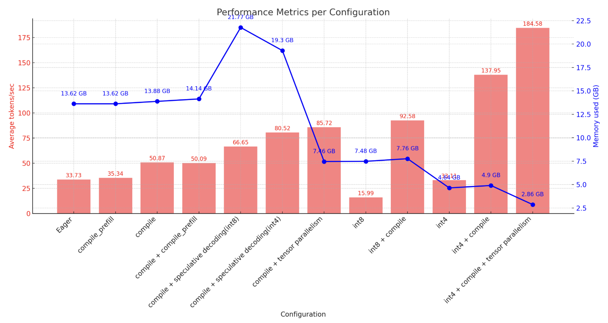

# gpt-fast-python
Simple and efficient pytorch transformer text generation.

This repository contains two large language model inference frameworks based on PyTorch.
## make-llama-faster
Initial version of the inference framework, developed based on the [llama2](https://github.com/facebookresearch/llama)  source code, supporting compilation, quantization, and inference speed testing for Llama2.
## llama-fast
Current version of the inference framework, additionally supports llama3 models, tensor parallelism, speculative decoding, and DRAM usage testing functionalities.

Experiments for Llama3-7b on NVIDIA A6000 GPUs:
